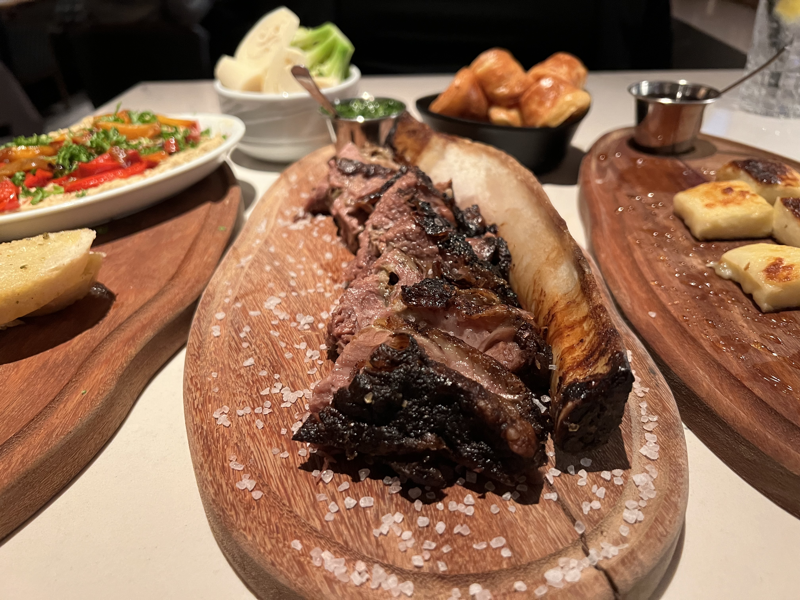

## Background
So yes, the Financial Disctrict is where prior to Covid, that most of the Tech workers worked before companies figured out it was cheaper to not pay rent and let their developers work from home. I guess things were more "financial" prior to that. That said, I worked at a tech company for a short period in the middle of it. Even back then, while crowded, it tended to clear out after about 7-8pm, after all the tech workers left. Basically, people would run out and either grab dinner or a drink or two - never much more than that, and then scoot home. Now, it's really quiet now that the giant buildings aren't full of tech workers. This is the area where a lot of things closed because of it. The rest of the city is pretty much "open", because people actually live there.

The main street here is Market Street. The Bart runs underneath it two levels under the ground.

### Bars and Food

Food - Brazilian BBQ - South of Market Street is [Fogo de Chão](https://fogodechao.com/location/san-francisco/) - yeah, there's a bunch of them but this one is really nice, and you can get your flex on excellent Brazilian BBQ here. If you go with a vegetarian, the salad bar option is way more than anyone can ask for, as I go with one on a regular basis.

Food - Seafood - The <a href="https://tadichgrillsf.com/" target="_blank">Tadich Grill</a> is supposedly real good, for seafood haven't been there yet, runs $50-100. Probably need reservations. You can walk here from the Omni.

Food - Beef - try out <a href="https://www.johnsgrill.com/" target="_blank">John's Grill</a>, a historic steak house, again runs $50-100, there's actually a cheap steak place across the street (not very good). Need a reservation. Say you were at he Omni, you'd walk to Montgomery street station, and take either the SF Muni or Bart (One stop) to Powell street station - trains will be heading to Daly City, SFO, or Millbrae for Bart. When you get out you'll see where the Rice-a-Roni is.

Food - Fried Chicken - Another famous place is the <a href="https://www.wayfaretavern.com/" target="_blank">The Wayfare Tavern</a>, owned by the Chef and host of "The Great Food Truck Race" Tyler Florence. Supposedly the best, again in the $50-100 range and likely need a reservation, I mean to check it out. There's a lot of other Fried Chicken places in town though that I bet are good.

Bars - For an interesting bar, check ot the <a href="https://www.paganidol.com/" target="_blank">Pagan Idol</a> - Walk into a the bowels of a ship, then continue to Tiki Area. Opens later, on Sat it looks like it opens at 4:30pm. If one were staying at the Omni, this is a short walk down the hill. Further away, is the Tonga Room - the site doesn't support HTTPS at the moment, just use your maps.

Bars - Another two blocks over is <a href="https://tunneltop.bar/" target="_blank">Tunnel Top</a>, old school sign, cool inside.
