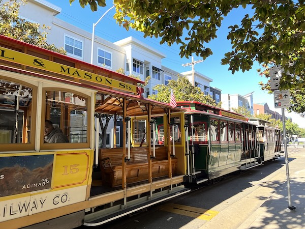
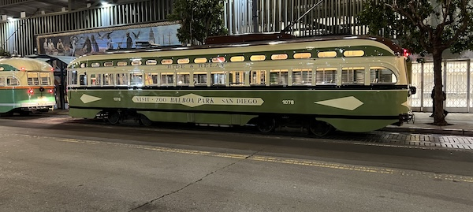
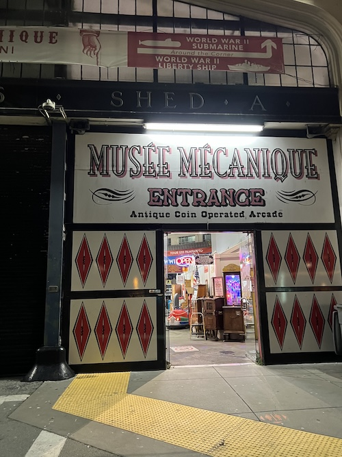
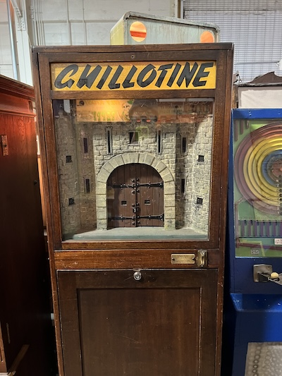
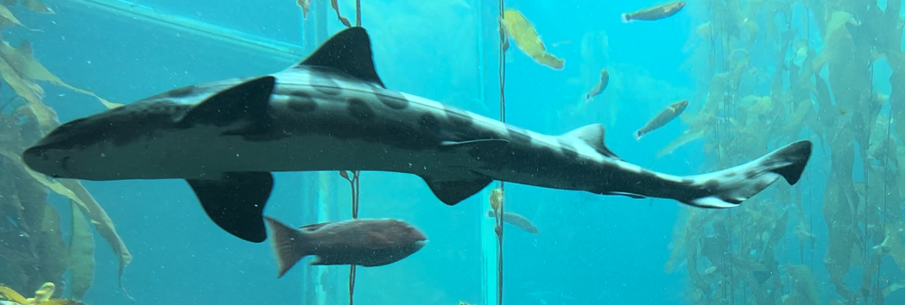

### Getting There
#### The Rice-a-Roni

This is assuming you want to ride the <a href="https://www.sfmta.com/getting-around/muni/cable-cars" target="_blank">Rice-a-Ron</a>. If you were say, to be staying at the Omni, you could:
- Walk: On google maps, search "Cable Car Turnaround Powell Street". However, you could split the walk and see something like Macy's at Union Square on the way, so set that first, and then search the other. Either way, I'd plan on a 20 min walk, as it's 0.7 to 0.9 miles to get there 
- Muni: Here you would walk to the Montgomery Station (Bart/Muni). As both the Bart and the Muni run underground for a bit along market, and you would only be going one stop, I suggest the Muni over the Bart. This is because a handful of different lines use the same track when underground, so they will be coming every 2-10 minutes during the day. You just have to get the direction right, which Google maps or the SFMuni trip planner will show. The lines off the top of my head are K, L, M, N. Probably irrelevant because I don't think there's any that don't cross between there and the Powell Street station. From there, get off at the next stop at Powell Street and the Turnaround point is there. Doing it this way is about 11 min to get to the Rice-a-Roni starting point

- Double Rice-a-Roni - A little risky, as most ride the main Rice-a-Roni (Powell-Hyde (PH)) or Powell-Mason (PM)) from Powell to the Pier area, but running Orthogonal to that is the California (CA) Rice-a-Roni. Which actually goes kind of close to the Omni, because of that, you can literally take the CA Rice-a-Roni to the corner where it intersects with the PM and PH lines.... however, this probably doesn't happen to frequently and there would have to be space on the PM or PH line, which would likely be packed with tourists where they would not be getting off anyhwere in between. Just saying you can ride a Rice-a-Roni to catch another Rice-a-Roni. Here though, you'd also be paying double because the Rice-a-Roni is one of the few that you don't get a transfer.

Remember, exact cash ($9) I beleive right now, Clipper Card are the way to go. Otherwise, you'd have to stand in a second line to get a ticket. I'd also only go to the Pier on the Rice-a-Roni, then when it's cold at night, take the F-muni old italian above trolley back.

#### Rice-a-roni on Powell/Market intersection to the Piers
On the Powell/Market two Rice-a-Roni lines come. If going to the Piers, then it kind of doesn't matter which one unless you are running late. The Powell Mason (PM) is closer to the actual Pier 39, while the Powell Hyde is closer to the shops where say Ghiradelli chocolate is.

#### Getting to Pier 33 for Alcatraz
Even though it may seem like Pier's 39 and 33 are pretty close, they are 0.6 miles apart, so if you are going to be going to Alcatraz where you'll be on your feet for a while, you could take the above ground F muni - old Italian bus cars.  So take that into account.

#### Getting back to downtown SF. 
##### Rice-a-Roni
This is where I'd go F muni over the Rice-a-Roni, unless you really like the Rice-a-Roni. If taking the Rice-a-Roni, the line will probably be shorter going on the Powell-Mason line at the corner of Taylor St. and Bay St, as you can't see it from the Pier area, and thus most tourists line up for the Powell-Hyde. Also most tourists book a round trip with paper tickets, and thus, even if it's raining or freezing, they aren't going to waste that ticket, so always expect a line.

##### F Muni

These are the old Italian electric buses you often see on Market Street. Going back they start at Jones & Beach street. This is the best place to get on. As they empty the bus right before that. It will hug the Embarcadero going past the Alcatraz Pier 33 area to the Ferry Building then do a quick set of turns and then head up Market Street. Here, get off at Montgomery Street. You could also pop off at the [Ferry Building](https://www.ferrybuildingmarketplace.com/) (Hours 7am to 8pm), and grab some Oysters and a drink at the [Hog Island Oyster Co.](https://hogislandoysters.com/) or checkout all the other touristy stuff in there.

### What to See

#### Musée Mécanique at Pier 45

The [Musée Mécanique](https://museemecanique.com/) isn't on the main tourist pier - But, it is something I highly recommend. They have a ton of old games that you can play and some new ones, but some go way way back in history. The oldest ones aren't actually games but "shows"... like this creepy one! 

#### Ripley's Believe it or Not!
[Ripley's Believe it or Not!](https://www.ripleys.com/attractions/ripleys-believe-it-or-not-san-francisco) is a quirky "museum" of sorts, like the above, it's not on the Pier but nearby.

#### Pier 39
[Pier 39](https://pier39.com/) is a tourist haven. You can see Sea Lions, shop, etc. In the event you are afraid of non-chain restaurants which are the greater majority of San Francisco's restaurant scene, both in and out of the immediate area of the pier are chain restaurants like Applebee's, The Hard Rock Cafe, and In-and-Out Burger.

#### Aquarium By the Bay

[Aquarium By the Bay](https://www.aquariumofthebay.org/) is actually on Pier 39, the coolest part is a tunnel you can walk through that goes through the aquarium.

### What to Eat

Boudin - Instead of eating at Applebee's, what you are supposed to do down here as a tourist is eat chowder in a sour dough bowl from [Boudin Sourdough](https://boudinbakery.com/bakers-hall-menu/). However, there are more options, this is the tourist thing to do if you are ok with not eating at a super well known chain, but still kind of in between going fully local.

Scoma's - Seafood - If you want an upscale meal where you need reservations - check out [Scoma's](https://scomas.com/)

Chocolate - I'm not much of a candy fan - but if you are the touristy thing to do is also to hit up [Ghiradelli's](https://www.ghirardelli.com/stores/sf-on-the-go)

There's a bunch of others around too, something for everyone.
