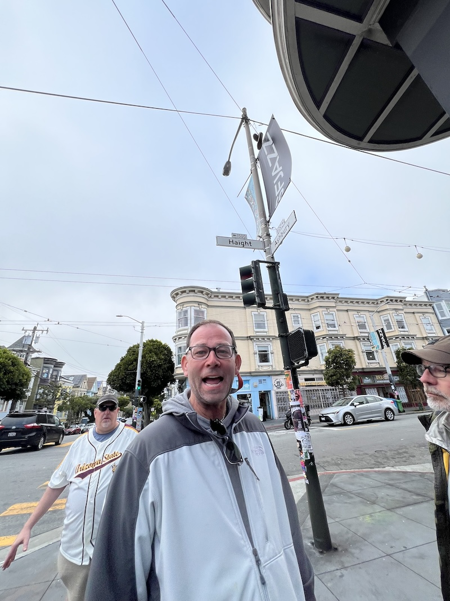
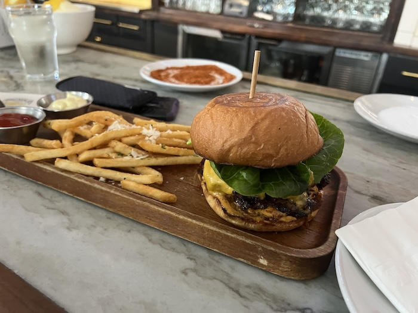

### What to do

No, these aren't the homeless, these are tourists from out of state, and the longer they stayed under the Haight and Ashbury street sign, the more distorted they became, so beware of the vortex here...

...this is an interesting area to walk around. There's one house with the "Love in Haight Fairy Garden" - probably better to see it in the day and night, at 1112-1114 Magnolia Ave

The more famous folks that lived here are (note regular people now own these homes, so don't bother them, go on their steps etc.):
- The Grateful Dead at 710 Ashbury Street
- Janis Joplin at 635 Ashbury Street
- And a little ways away towards the park was Jefferson Airplane at 2400 Fulton Street

Also, there is the [Psychedelic SF Art Gallery](https://www.psychedelicsfartgallery.com/) - however, this does have limited hours

### Food and Drink

The only spot I've been to is [Magnolia Bar & Kitchen](https://www.magnoliahaight.com/) - burger was pretty good, it's not all vegan/GF here.
